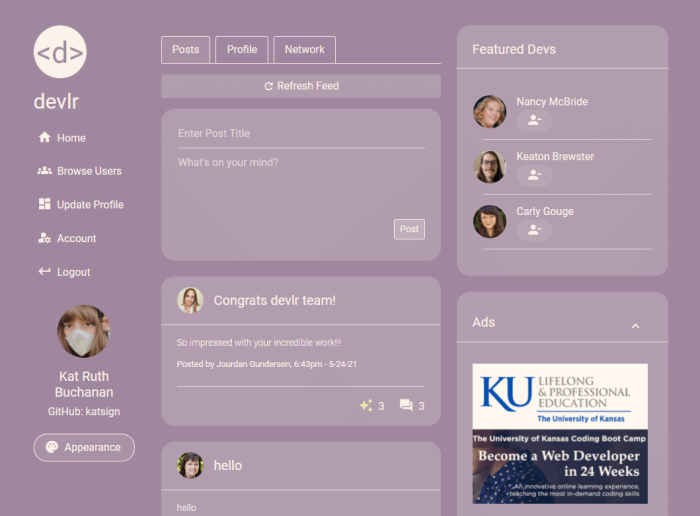

# Meet Kat Ruth | digitalNative, digitalCreative 🌞

 
 

#### 📍 [View Deployment on GitHub Pages](https://katsign.github.io/portfolio2.0/) 📍

## *Description*

Hey, I'm Kat. 👋 A digitally-native digital creative.

I'm a full-stack web developer with an emphasis on design, front-end UIs and simplified user experiences. This repo contains the source code for my web development portfolio built with React. View six recent projects I've created and contributed to alongside my resume and contact info.

## *Featured Projects*

[React User Directory](https://katsign.github.io/react-user-directory/)           |  [devlr Developer Network](https://devlr.herokuapp.com/)
:-------------------------:|:-------------------------:
  |  

[Progressive Budget Tracker](https://katsign-budget-tracker.herokuapp.com/)           |   [Express Burger Logger](https://katsign-gotta-eat.herokuapp.com/)
:-------------------------:|:-------------------------:
  |  

[DevTeam Profile Generator](https://katsign.github.io/devteam/)           |   [PAIR Culinary Curation](https://brandyquinlan.github.io/PAIR/)
:-------------------------:|:-------------------------:
  |  

## *Contact*
🔗 Links in Bio @[katsign](https://github.com/katsign)

---
&copy; 2021